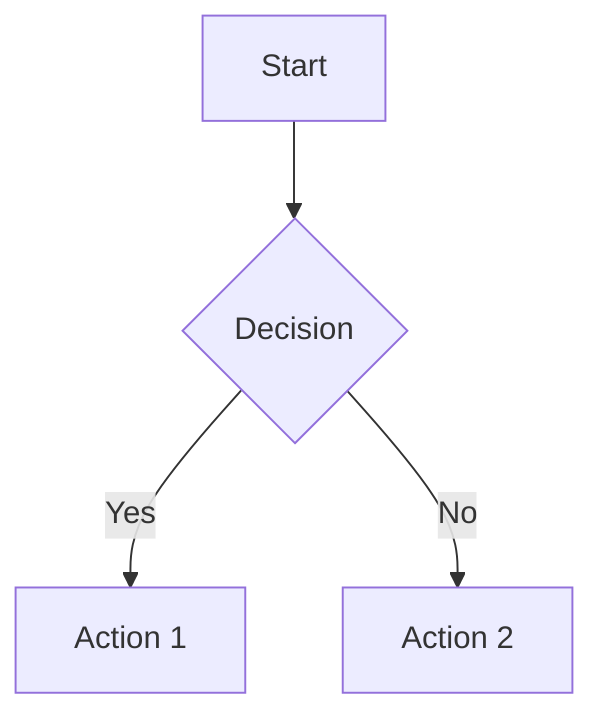

# CLAUDE.md

This file provides guidance to Claude Code (claude.ai/code) when working with code in this repository.

## Project Overview

CuriousCore AI is an interactive learning platform built with React, TypeScript, and a Python FastAPI backend. The application provides AI-powered educational challenges where users progress through structured learning experiences with chat-driven interaction.

## Key Technologies

- **Frontend**: React 18 + TypeScript + Vite
- **UI Framework**: shadcn/ui (Radix UI primitives) + Tailwind CSS
- **Backend**: FastAPI + SQLAlchemy (SQLite for local dev, PostgreSQL in Docker/production) with JWT auth
- **State Management**: TanStack Query (React Query)
- **Routing**: React Router v6
- **Markdown Rendering**: react-markdown + remark-gfm + rehype-highlight + mermaid (for diagrams)

## Common Development Commands

### Docker (Recommended)

```bash
# Start all services with Docker
./scripts/docker-dev.sh

# View logs (color-coded, all services)
./scripts/docker-logs.sh
./scripts/docker-logs.sh backend   # Backend only
./scripts/docker-logs.sh frontend  # Frontend only

# Check status and resource usage
./scripts/docker-status.sh

# Stop all services
./scripts/docker-stop.sh
# or Ctrl+C if running in foreground

# See DOCKER.md for full guide
```

### Local Scripts (Alternative)

```bash
# Start both backend + frontend
./scripts/dev.sh

# Start backend only
./scripts/dev-backend.sh

# Start frontend only
./scripts/dev-frontend.sh

# Stop all services (kills orphaned processes)
./scripts/stop.sh

# Check service status
./scripts/status.sh

# Frontend: install deps
cd frontend && npm i

# Frontend: build for production
cd frontend && npm run build
cd frontend && npm run build:dev
cd frontend && npm run preview
cd frontend && npm run lint

# Backend: install deps
python -m venv .venv && source .venv/bin/activate
pip install -r backend/requirements.txt

# Backend: run tests
# IMPORTANT: Always activate the virtual environment first!
cd backend
source ../.venv/bin/activate
python -m pytest tests/ -v

# Run specific test module
python -m pytest tests/game_engine/test_engine.py -v

# Run with coverage
python -m pytest tests/ --cov=app --cov-report=html
```

## Service Management

### Docker vs Local Development

**Docker (Recommended):**
- ✅ **Best log visibility**: Color-coded, timestamped logs via `docker compose logs`
- ✅ **PostgreSQL database**: Production-like environment with PostgreSQL 16
- ✅ **No orphaned processes**: Docker manages lifecycle automatically
- ✅ **Easy environment setup**: One command (`./scripts/docker-dev.sh`)
- ✅ **Process monitoring**: `docker stats` shows CPU/memory usage
- ⚠️ **Hot reload**: ~1-2 second delay (good, not instant)

**Local Scripts:**
- ✅ **Fastest hot reload**: Instant file change detection
- ✅ **Direct debugging**: Easier to attach debuggers
- ⚠️ **SQLite database**: Simpler but less production-like
- ⚠️ **Manual setup**: Requires venv, npm install
- ⚠️ **Orphaned processes**: Use `./scripts/stop.sh` if services don't exit properly

All services run with **maximum verbosity** for debugging:

- **Backend**: Debug-level logs, SQL queries, HTTP access logs, colored output
- **Frontend**: Debug mode with detailed info logs and HMR notifications
- **Docker logs**: Automatically prefixed with service name and color-coded
- **Local logs**: Prefixed with `[BACKEND]` and `[FRONTEND]` when using `dev.sh`

**Documentation:**
- **DOCKER.md** - Comprehensive Docker development guide with PostgreSQL
- **DOCKER-QUICKSTART.md** - Quick reference for Docker commands
- **RAILWAY.md** - Production deployment guide for Railway with PostgreSQL

## Architecture

### Application Structure

The app uses a standard React SPA architecture with a separate FastAPI backend:

- `frontend/src/pages/` - Top-level route components (Dashboard, Auth, Challenge, Profile, Admin)
- `frontend/src/components/` - Reusable UI components (primarily shadcn/ui components in `ui/` subdirectory)
- `frontend/src/hooks/` - Custom React hooks for business logic and data fetching
- `frontend/src/lib/api.ts` - Frontend API client (attaches JWT to requests)
- `backend/` - FastAPI app, models, and endpoints

### Authentication & Authorization

Authentication is managed through a custom `AuthProvider` context (`frontend/src/hooks/useAuth.tsx`) backed by FastAPI JWT endpoints. Key features:

- Email/password authentication via `/auth/register` and `/auth/login`
- JWT stored in localStorage and sent via `Authorization: Bearer`
- `isAdmin` derived from the `role` field on the user model
- Unauthenticated users are redirected to `/auth`

### Data Flow

1. **TanStack Query** is used for all data fetching/caching.
2. **Custom hooks** encapsulate API calls to FastAPI:
   - `useChallenges()` - Fetches active challenges
   - `useUserProgress()` - Manages user progress on challenges
   - `useProfile()` - Handles user profile, XP, and badges
3. **API client** (`frontend/src/lib/api.ts`) centralizes base URL and JWT headers.

### Challenge System

The core feature is an interactive challenge system:

- **Challenges** are stored in the FastAPI database with system prompts, difficulty levels, and XP rewards.
- **User Progress** tracks completion status, score, messages, current phase, and mistakes.
- **Chat Interface** (Challenge.tsx) posts to the backend `/chat` route, which proxies to an AI gateway and returns content + metadata.
- Messages include metadata for question types (text/MCQ), hints, and progress tracking.

The chat flow:
1. User starts a challenge → backend creates/updates progress.
2. Messages are posted to `/chat` with current phase/progress.
3. Backend calls the configured AI gateway and returns content plus parsed metadata.
4. Frontend updates progress, score, and XP based on metadata.

### Chat Message Rendering

Chat messages in challenges support rich markdown formatting with several enhancements:

- **Markdown Rendering**: Uses `react-markdown` with GitHub Flavored Markdown (GFM) support
- **Code Highlighting**: Syntax highlighting for code blocks via `rehype-highlight` with the GitHub Dark theme
- **Mermaid Diagrams**: Code blocks with the `mermaid` language identifier automatically render as interactive diagrams

**Component Architecture**:
- `ChatMessage.tsx` - Main message component with markdown rendering
- `MermaidDiagram.tsx` - Dedicated component for rendering mermaid diagrams with error handling

**AI-Generated Content**:
When generating chat responses, the LLM can include mermaid diagrams using standard markdown syntax:

````markdown

````

**Mermaid Features**:
- All diagram types supported (flowchart, sequence, class, state, gantt, etc.)
- Dark theme matching the application design system (purple/cyan accent colors)
- Error handling with fallback to code display
- Dynamic import for optimized bundle size
- Responsive with horizontal scrolling for large diagrams

### Database Schema

Key tables (via SQLAlchemy models):
- `users` - Email/password auth, role, XP, level
- `badges` / `user_badges` - Achievement system
- `challenges` - Prompts, difficulty, rewards
- `user_progress` - Status, score, messages, phase tracking

### Path Aliases

The project uses `@/` as an alias for the `frontend/src/` directory (configured in vite.config.ts and tsconfig.json).

## Environment Variables

Required environment variables (stored in `.env`):
- `VITE_API_BASE_URL` - FastAPI base URL (frontend)
- `DATABASE_URL` - DB connection string (`sqlite+aiosqlite:///./backend/app.db` for dev or Postgres URI)
- `SECRET_KEY` - JWT signing key
- `AI_GATEWAY_URL` / `AI_GATEWAY_API_KEY` - Upstream model gateway for instructor chat

## Styling

The project uses Tailwind CSS with a custom theme configuration (tailwind.config.ts). UI components follow the shadcn/ui design system with customizable CSS variables for theming.

Component styling pattern:
- Use Tailwind utility classes
- Leverage `class-variance-authority` for variant-based styling
- Use `cn()` utility from `lib/utils.ts` for conditional classes
